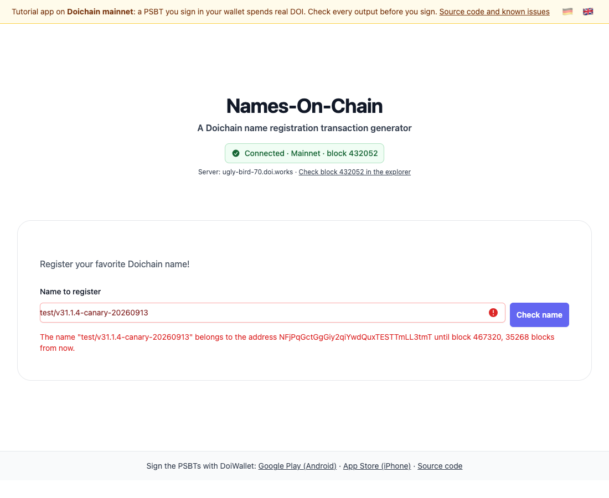

# Lektion 1: Mit der Kette reden

[English](01-electrumx-name-lookup.md) · App [`apps/lesson01`](../../apps/lesson01) · [Live-Demo](https://doichain.github.io/names-on-chain/lesson01/) · Weiter: [Lektion 2](02-utxos-name-coins-expiry.de.md)

Die App verbindet sich mit einem Doichain-Server und schlägt Namen nach: wem ein Name gehört und bis zu welchem Block.



## Was Sie lernen

- Wie eine Webseite über einen WebSocket mit einem Blockchain-Server spricht.
- Wie ein Server einen Namen findet: nicht über den Text, sondern über den Hash eines kleinen Skripts, das aus dem Namen entsteht.
- Wann ein Name frei, vergeben oder abgelaufen ist.

## Wo der Code liegt

Der Workshop ist ein Repository. Diese Lektion ist die App `apps/lesson01`, und darin
steht, was diese Lektion schreibt: das Nachschlagen eines Namens (`nameShow.js`), die
Coins einer Adresse (`nameDoi.js`), die Namensprüfung und die Seite. Zweierlei kommt
von außerhalb, und der Import sagt immer, woher:

- `packages/doichain` – was keine Lektion für sich lehrt: die ElectrumX-Verbindung, der
  Store, die kleinen Komponenten, die beiden Übersetzungskataloge und die
  aufgezeichneten Serverantworten, mit denen die Tests sprechen.
- Die späteren Lektionen importieren aus **dieser** App. Lektion 2 kopiert das
  Nachschlagen nicht, sie schreibt
  `import { nameShow } from '@names-on-chain/lesson01/doichain/nameShow.js'`. Wenn in
  Lektion 4 also `@names-on-chain/lesson03` steht, heißt das: Das haben Sie in
  Lektion 3 geschrieben.

Eine eigene Fassung einer Datei behält eine Lektion nur, wenn sie sie ändert – und dann
ist die Änderung der Lehrinhalt.

## Start

```bash
git clone https://github.com/Doichain/names-on-chain.git
cd names-on-chain
corepack enable && pnpm install --frozen-lockfile
pnpm --filter @names-on-chain/lesson01 dev
```

Sie brauchen Node 22 (siehe `.nvmrc`). Öffnen Sie die Adresse, die der Befehl ausgibt, meist http://localhost:5173.

## Checkpoint

- Nach ein, zwei Sekunden steht unter dem Titel **Verbunden · Mainnet · Block …**, dazu der Name des Servers.
- Tippen Sie `doichain` und klicken Sie auf **Name prüfen**. Die App meldet den Namen als frei: Er war schon registriert und ist bei Block 389030 abgelaufen.
- Tippen Sie `test/v31.1.4-canary-20260913`, einen Namen, der nach dem Chain-Split registriert wurde, und prüfen Sie ihn. Die App nennt die Adresse, der er gehört, und den Block, bis zu dem er ihr gehört.
- Tippen Sie etwas anderes. Die Meldung verschwindet, im Feld steht **Noch nicht geprüft**: Ohne Ihre Frage geht nichts an einen Server.

## So funktioniert es

### 1. Verbindung zu einem Server

`src/routes/+layout.js` startet die Verbindung, sobald die Seite lädt. `packages/doichain/src/connectElectrum.js` wählt zufällig einen der Server aus `doichain-store.js` und öffnet mit `electrum.ElectrumClient` aus `@doichain/doichainjs-lib` einen WebSocket zu ihm. Anfragen und Antworten sind JSON-RPC-Nachrichten; der Client gibt eine unbeantwortete Anfrage auf, hält eine stille Verbindung mit einem Ping offen und meldet über `onclose`, wenn sie weg ist. Welchen Server die App als Nächstes nimmt, entscheidet sie selbst.

Ein Server antwortet mit der Kette, der sein Knoten folgt, und schickt keinen Beweis mit. Bevor die App einer Antwort traut, fragt sie deshalb nach Block 431.018 und vergleicht dessen Hash mit dem, den sie kennt (`electrum.verifyChain`, mit dem Prüfpunkt aus der Bibliothek). Ein Server auf der alten Kette zählt als Fehlversuch, und die App versucht einen anderen. `ConnectionStatus.svelte` zeigt jeden Schritt an.

Warum 431.018 und nicht 431.017, der Block, mit dem die neuen Regeln griffen? Weil dieser auf beiden Ketten steht: Doichain hat das Schwierigkeitsfeld nie durchgesetzt, also haben ihn die alten Knoten ebenfalls angenommen. Beide Ketten setzen ihren nächsten Block darauf – und dort trennen sie sich.

### 2. Einen Namen prüfen

`apps/lesson01/src/lib/components/pricing.svelte` gibt den Namen an `checkName` in `nameValidation.js` weiter, sobald Sie auf **Name prüfen** klicken oder Enter drücken – nie beim Tippen, denn jede Prüfung reicht den Namen an einen Server weiter. `debounce.js` sitzt weiter davor, damit ein zweiter Klick innerhalb von 300 Millisekunden nur einmal fragt. Dann:

1. lehnt sie Namen mit Leerzeichen, mit weniger als 4 Zeichen oder mit mehr als 255 Bytes ab,
2. fragt sie den Server nach der Geschichte des Namens (`nameShow.js`),
3. nimmt sie die neueste Operation und berechnet, wann der Name abläuft (`nameExpiry.js`).

### 3. Wie der Server einen Namen findet

Der Server indiziert Namen nicht nach ihrem Text. Er indiziert ein Skript, das aus dem Namen gebaut wird,

```
OP_NAME_UPDATE <Name> <leerer Wert> OP_2DROP OP_DROP OP_RETURN
```

unter dem SHA-256-Hash dieses Skripts. `nameops.nameIndexScriptHash` aus [doichainjs-lib](https://github.com/Doichain/doichainjs-lib) baut es. Mit diesem Hash liefert `blockchain.scripthash.get_history` jede Transaktion, die den Namen geschrieben hat, und `blockchain.transaction.get` jede Transaktion mit bereits dekodierter Namensoperation.

### 4. Frei, vergeben oder abgelaufen

Ein Name gehört 36.000 Blöcke lang, etwa 250 Tage, der Adresse seiner neuesten Operation. Danach darf ihn jeder neu registrieren. Eine Operation, die noch auf ihren Block wartet, hat noch keine Blockhöhe; die App sagt das, statt ein Ablaufdatum zu raten.

## Übung

Schlagen Sie einen Namen ohne die App nach. Speichern Sie das Skript als `name-history.mjs` im Projektordner und starten Sie `node name-history.mjs doichain`:

```js
import { nameops } from '@doichain/doichainjs-lib';

const name = (process.argv[2] ?? 'doichain').normalize('NFC');
const socket = new WebSocket('wss://big-parrot-60.doi.works:50004/');
const waiting = new Map();
let lastId = 0;

const request = (method, params = []) =>
	new Promise((resolve, reject) => {
		waiting.set(++lastId, { resolve, reject });
		socket.send(JSON.stringify({ jsonrpc: '2.0', id: lastId, method, params }) + '\n');
	});

socket.onmessage = (event) => {
	const message = JSON.parse(event.data);
	const call = waiting.get(message.id);
	if (!call) return; // eine Benachrichtigung, keine Antwort
	waiting.delete(message.id);
	if (message.error) call.reject(new Error(message.error.message));
	else call.resolve(message.result);
};

socket.onopen = async () => {
	const history = await request('blockchain.scripthash.get_history', [
		nameops.nameIndexScriptHash(name)
	]);
	for (const { tx_hash, height } of history) {
		const tx = await request('blockchain.transaction.get', [tx_hash, true]);
		const output = tx.vout.find((vout) => vout.scriptPubKey.nameOp);
		const { op, value } = output.scriptPubKey.nameOp;
		console.log(`block ${height}: ${op} to ${output.scriptPubKey.address}, value "${value}"`);
	}
	socket.close();
};
```

Es gibt eine Operation in Block 353030 aus. Plus 36.000 ergibt 389030, den Block, den die App nennt.

Ändern Sie danach die App: Bei einem vergebenen Namen soll sie zusätzlich die verbleibenden Tage anzeigen, bei zehn Minuten pro Block.

<details>
<summary><strong>Unter der Haube</strong></summary>

- **Das Index-Skript, Byte für Byte.** Für `doichain` lautet es `53 08 646f69636861696e 00 6d 75 6a`: `OP_3` (bei Namecoin `OP_NAME_UPDATE`), ein Push von 8 Bytes mit dem Namen, `OP_0` als leerer Wert, `OP_2DROP`, `OP_DROP`, `OP_RETURN`. Der Server speichert den SHA-256-Hash dieser Bytes in umgekehrter Byte-Reihenfolge.
- **Bytes, keine Zeichen.** Namen werden als UTF-8-Bytes gespeichert; `münchen` braucht 8 davon. Die App normalisiert einen Namen vor dem Hashen auf Unicode NFC und warnt vor Zeichen jenseits von ASCII und vor Namen, die Alphabete mischen: Gleich aussehende Namen können aus verschiedenen Bytes bestehen.
- **Anfragen und Benachrichtigungen.** Eine Anfrage trägt eine `id`, ihre Antwort dieselbe `id`. Nach `blockchain.headers.subscribe` kommen neue Blöcke als Benachrichtigungen ohne `id`. Der Client sendet alle 90 Sekunden einen Ping, weil ElectrumX stille Verbindungen schließt, und eine Anfrage scheitert nach 30 Sekunden ohne Antwort.
- **Was der Prüfpunkt beweist.** Nur, dass die Kette des Servers Block 431.018 der gültigen Kette enthält – den ersten Block, den die beiden Ketten nicht teilen. Über neuere Blöcke und über Transaktionen beweist er nichts, und ein Server kann weiterhin Daten weglassen. Mit dem Explorer-Link neben dem Servernamen vergleichen Sie den neuesten Block selbst.
- **Warum der Split für Namen zählt.** Vor Block 431.017 durfte nach den alten Regeln jeder einen registrierten Namen überschreiben. Seitdem ändert ihn nur eine Transaktion, die den vorigen Output des Namens ausgibt.

</details>

## Typische Probleme

- **Die Statuszeile zählt Versuche hoch.** Ihr Netzwerk blockiert vielleicht WebSockets auf Port 50004. Versuchen Sie ein anderes Netzwerk.
- **„folgt nicht der gültigen Doichain-Kette“.** Dieser Server hängt zurück oder folgt der alten Kette. Die App wechselt von selbst zu einem anderen Server.
