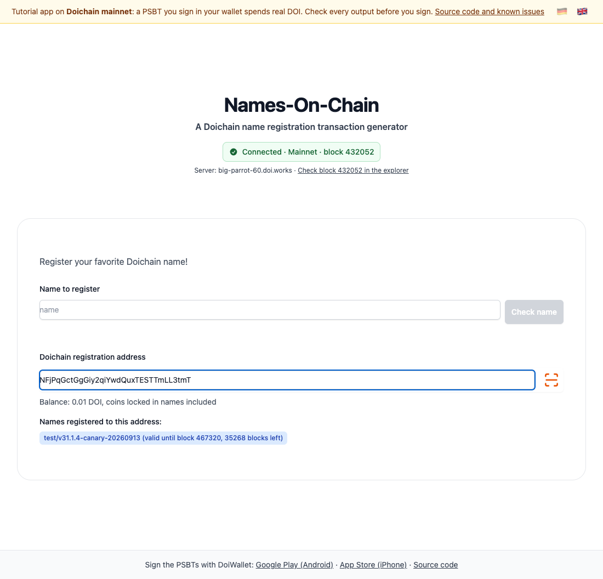

# Lektion 2: Coins, Namens-Coins und Ablauf

[English](02-utxos-name-coins-expiry.md) · App [`apps/lesson02`](../../apps/lesson02) · [Live-Demo](https://doichain.github.io/names-on-chain/lesson02/) · Zurück: [Lektion 1](01-electrumx-name-lookup.de.md) · Weiter: [Lektion 3](03-name-registration-psbt.de.md)

Unter dem Namen bekommt die App ein Adressfeld. Zu einer Adresse zeigt sie das Guthaben und die Namen, die sie hält, jeweils mit dem Block, bei dem der Name abläuft.



## Was Sie lernen

- Was UTXOs sind: die einzelnen Coins, die einer Adresse gehören.
- Wie ein Server die Coins einer Adresse findet und wie sich ein Coin mit Namen von einem gewöhnlichen unterscheidet.
- Wie die App eine Adresse aus einem QR-Code liest oder eingefügt übernimmt.

## Start

```bash
pnpm --filter @names-on-chain/lesson02 dev
```

## Checkpoint

- Geben Sie eine Doichain-Adresse aus DoiWallet ein: `M…` oder `N…` (P2PKH) oder `dc1q…` (P2WPKH). Eine falsche oder eine Bitcoin-Adresse wird als ungültig markiert.
- Unter dem Feld steht **Guthaben: … DOI, einschließlich der in Namen gebundenen Coins**.
- Hält die Adresse Namen, erscheint jeder mit dem Block, bei dem er abläuft, als abgelaufen oder als noch nicht in einem Block.
- Der Scan-Button neben dem Feld öffnet einen Dialog. Er liest einen QR-Code mit der Kamera; ohne Kamera sagt er, woran es liegt, und nimmt die Adresse eingefügt an. Ein gescannter `doichain:`-Zahlungslink wird zur reinen Adresse.

## So funktioniert es

### 1. Eine Adresse ist ein Output-Skript

`isAddressOf` in `apps/lesson02/src/lib/doichain/addressValidation.js` verwandelt den Text mit `address.toOutputScript` aus doichainjs-lib in das Output-Skript, für das er steht. Das prüft Prüfsumme, Netzwerk-Präfix und Adresstyp in einem Schritt. `cleanAddressInput` entfernt Leerzeichen und einen `doichain:`-Zahlungslink.

### 2. Die Coins einer Adresse

`getUTXOSFromAddress` in `nameDoi.js` hasht dieses Output-Skript mit SHA-256 und fragt `blockchain.scripthash.listunspent` nach den nicht ausgegebenen Outputs, den Coins. Zu jedem Coin lädt es die Transaktion, die ihn erzeugt hat, denn nur dort sieht man, ob der Coin einen Namen trägt.

### 3. Coins und Namens-Coins

`getUtxosAndNamesOfAddress` in `utxoHelpers.js` sortiert sie: Coins ohne Namen kommen in die Liste der ausgebbaren Coins, Coins mit Namensoperation in die Liste der Namen. Das Guthaben zählt beide zusammen.

### 4. Ablauf

`pricing.svelte` zeigt jeden Namen mit `nameExpiry`: gültig bis zum Block der letzten Operation plus 36.000, wie viele Blöcke noch bleiben, abgelaufen oder noch ohne Block. Der neueste Block kommt aus dem Header-Abonnement beim Server und aktualisiert sich von selbst.

## Übung

- Zeigen Sie neben jedem Namen „noch etwa D Tage“ an, bei zehn Minuten pro Block.
- An mehreren Stellen ist das Netz fest auf Mainnet eingestellt. Finden Sie jede Verwendung von `DOICHAIN`, die stattdessen den Store `network` nutzen sollte, damit die Lektion auch auf Regtest liefe.

<details>
<summary><strong>Unter der Haube</strong></summary>

- **Zwei Arten von Adressen.** Eine P2PKH-Adresse (`M…`, `N…`) steht für `76 a9 14 <20 Bytes> 88 ac`: `OP_DUP OP_HASH160 <Hash des öffentlichen Schlüssels> OP_EQUALVERIFY OP_CHECKSIG`. Eine P2WPKH-Adresse (`dc1q…`) steht für `00 14 <20 Bytes>`: ein SegWit-Programm der Version 0. Doichain hat kein Taproot; eine `dc1p…`-Adresse wird abgelehnt.
- **Script-Hash.** Der Server indiziert jedes Output-Skript unter seinem SHA-256-Hash in umgekehrter Byte-Reihenfolge, nach demselben Schema wie die Namen in Lektion 1.
- **swartz und DOI.** Beträge sind auf der Kette ganze Zahlen in swartz; 1 DOI = 100.000.000 swartz. Die App rechnet nur für die Anzeige um.
- **Gebunden, nicht verbrannt.** Eine Registrierung legt 0,01 DOI in den Output des Namens. Der Coin bleibt Ihrer und wandert mit dem Namen, wenn Sie ihn aktualisieren oder verkaufen. Allein ausgeben lässt er sich nicht, und nach dem Ablauf des Namens gar nicht mehr.
- **Regtest.** Auf Regtest läuft ein Name nach 30 Blöcken ab, der Ablauf lässt sich also in Minuten ausprobieren.

</details>

## Typische Probleme

- **„Das ist keine gültige Doichain-Adresse.“** Die Adresse gehört zu einem anderen Netz, enthält einen Tippfehler oder ist eine Taproot-Adresse.
- **Die Kamera startet nicht.** Browser erlauben die Kamera nur auf HTTPS-Seiten und auf `localhost`. Fügen Sie die Adresse stattdessen ein.
