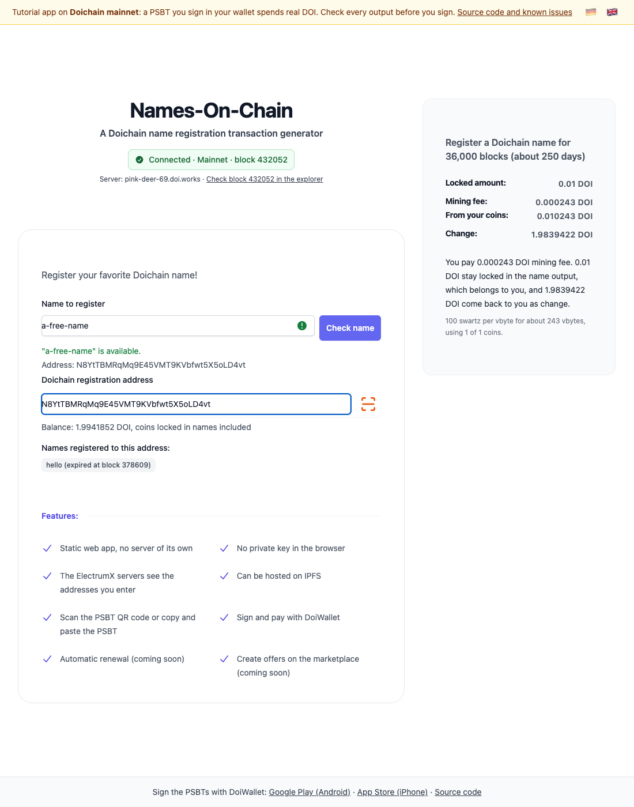

# Lesson 3: A registration as a PSBT, without a key

[Deutsch](03-name-registration-psbt.de.md) · Branch [`lesson03`](https://github.com/Doichain/names-on-chain/tree/lesson03) · [Live demo](https://doichain.github.io/names-on-chain/lesson03/) · Previous: [Lesson 2](02-utxos-name-coins-expiry.md) · Next: [Lesson 4](04-psbt-over-qr-and-signing.md)

For a free name and an address with coins, the app builds the transaction that registers the name, as an unsigned PSBT. A box on the right shows what it costs. The PSBT itself appears on screen in lesson 4.



## What you learn

- What a PSBT is: a transaction that is complete except for the signatures.
- How the app chooses coins and computes a fee that nodes accept.
- What a name output looks like, byte by byte, and what makes one unspendable.

## Start

```bash
git switch lesson03
pnpm install --frozen-lockfile
pnpm dev
```

## Checkpoint

- Type a free name and enter an address with at least 0.02 DOI.
- The box **Register a Doichain name for 36,000 blocks** fills in: locked amount, mining fee, what leaves your coins, change.
- Below it a sentence says what you pay, and a small line names the fee rate, the size and how many of your coins are used.

## How it works

### 1. When the app builds

`pricing.svelte` rebuilds the transaction whenever the name has been checked and is free, and the address is valid and its coins are loaded. Nothing from an earlier name or address stays on screen while it does.

### 2. Coins you can trust

`buildNameRegistrationPsbt` in `src/lib/doichain/buildNameRegistrationPsbt.js` does not take amounts from the server's JSON. `verifiedOutput` in `transactionChecks.js` reads each coin from the raw transaction that created it, after checking that the hash of that transaction is the txid the input spends. A coin that already holds a name is refused: spending it without a name operation would make the transaction invalid.

### 3. Choosing coins and the fee

`selectCoins` in `fees.js` takes confirmed coins before unconfirmed ones and large coins before small ones, until they cover 0.01 DOI plus the fee for exactly these coins. It uses at most 20 coins. The fee is the estimated size in vbytes times the fee rate. The rate is at least 100 swartz per vbyte, the minimum relay fee of Doichain Core; the app follows a server that asks for more, up to 1,000.

### 4. The transaction

- **Version** `0x7100`, which marks a name transaction.
- **Inputs:** the chosen coins. Each carries its whole previous transaction (`nonWitnessUtxo`), so the wallet can check amounts itself; SegWit coins also carry `witnessUtxo`.
- **Output 1:** the name with an empty value and 0.01 DOI, to your address (`getNameOPStackScript.js`).
- **Output 2:** the change, to your address. Change below 546 swartz would be dust and goes to the miners instead.

`checkNameTransaction` checks the version and that there is exactly one name output before the PSBT leaves the function. If anything fails, the result is an error and no PSBT at all.

## Exercise

- Print the PSBT in the browser console and decode it with `Psbt.fromBase64(...)` from `@doichain/doichainjs-lib`. Find the one output whose script starts with `5a`.
- Run `pnpm exec vitest run src/lib/doichain/nameScript.test.js`. It rebuilds name outputs recorded on Doichain mainnet byte for byte.

<details>
<summary><strong>Under the hood</strong></summary>

- **A name output, byte by byte.** Registering `test` with the value `hello` for a P2PKH address gives `5a 04 74657374 05 68656c6c6f 6d 75 76a914…88ac`: `OP_NAME_DOI` (`OP_10`), a push of 4 bytes, a push of 5 bytes, `OP_2DROP`, `OP_DROP`, then the ordinary output script of the holder.
- **Pushes with their length.** The builder writes every push as a length byte and the data, from bytes. A general script compiler turns a one-byte value from `0x01` to `0x10` into `OP_1`…`OP_16`, and Doichain's name parser does not read that as a value. An empty value is written as `00`.
- **Limits in bytes.** A name has at most 255 bytes. Doichain Core accepts values up to 1,023 bytes, but spending an output runs its whole script, and the interpreter refuses every push longer than 520 bytes. A longer value would freeze the name and its 0.01 DOI, which is why the app stops at 520.
- **Only P2PKH and P2WPKH holders.** The builder turns the holder's address into its real output script and accepts only the two types DoiWallet can sign for. A builder that copied only the hash out of a P2SH address would write a P2PKH script for a key nobody has, and the name and its coin would be locked for good.
- **Registrations can be taken away.** `OP_NAME_DOI` registers in one step. Whoever sees a pending registration can try to register the same name first; the transaction that is mined first wins. Every name you check also goes as a hash to a server. [Wallet and safety](../wallet-and-safety.md) explains what that means for you.
- **The two-step way.** Namecoin's `name_new` commits to a salted hash first and reveals the name with `name_firstupdate` twelve blocks later, so nobody can see the name in advance. Doichain Core still knows both operations. A name created that way can only be changed with `OP_NAME_UPDATE` afterwards, never with `OP_NAME_DOI`, and DoiWallet does not build these transactions.

</details>

## Common problems

- **"The funds on … are not enough for this Doichain name."** The coins do not cover 0.01 DOI plus the fee.
- **"The coins on … are split into too many small amounts"** More than 20 coins would be needed. Send the coins to yourself in DoiWallet to combine them.
