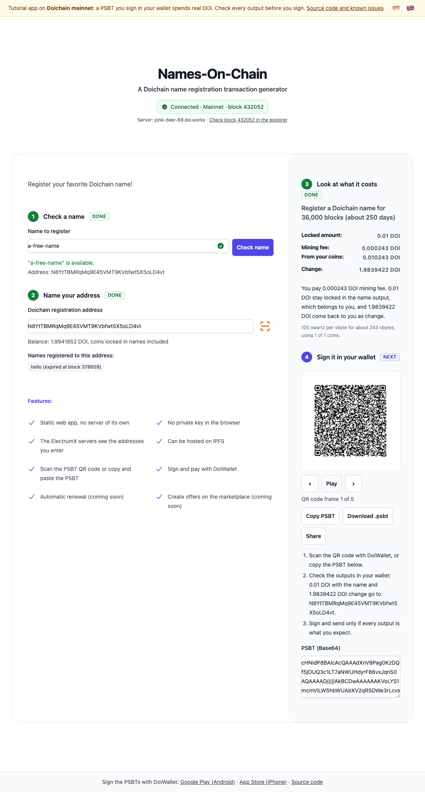

# Lesson 4: The PSBT over QR, signed in the wallet

[Deutsch](04-psbt-over-qr-and-signing.de.md) · App [`apps/lesson04`](../../apps/lesson04) · [Live demo](https://doichain.github.io/names-on-chain/lesson04/) · Previous: [Lesson 3](03-name-registration-psbt.md) · Next: [Lesson 5](05-atomic-name-trading.md)

The registration PSBT from lesson 3 leaves the browser: as an animated QR code that DoiWallet scans, as text to copy, or as a `.psbt` file. DoiWallet signs and sends it. The app never signs and never sends.



## What you learn

- How a PSBT that is too long for one QR code travels as a sequence of QR codes (BC-UR).
- What to check in the wallet before you sign.
- Why the app hands the transaction over instead of sending it.

## What you bring along

From the lessons before — this lesson writes no PSBT of its own:

- `@names-on-chain/lesson03/doichain/buildNameRegistrationPsbt.js` — the registration
  you built in lesson 3, unchanged.
- `@names-on-chain/lesson03/doichain/fees.js` and `transactionChecks.js`.
- `@names-on-chain/lesson02/doichain/addressValidation.js` and `utxoHelpers.js`.

New in `apps/lesson04`: `describePsbt.js`, `PsbtQr.svelte` and this lesson's own
`renderQR.js` — a frame grows from 50 to 120 bytes here, which is why the app keeps
its own. Lesson 5 imports all three from here.

## Start

```bash
pnpm --filter @names-on-chain/lesson04 dev
```

### Write it yourself

```bash
pnpm start-state lesson04
```

That empties the part of `renderQR.js` this lesson is about — turning the PSBT into QR frames — and leaves a
TODO in its place. The app still builds and still starts; it stops exactly there. When
you want the answer back:

```bash
git checkout apps/lesson04
```

## Checkpoint

- With a free name and an address with coins, the button **Create PSBT** appears. It draws an animated QR code on a white background.
- **Pause**, **Previous frame**, **Next frame**, **Copy PSBT**, **Download .psbt** and, where the browser can share files, **Share** control it. A line says which frame is on screen.
- Below it three steps say what to do in DoiWallet, and a text field holds the PSBT in Base64.
- Scan the code with DoiWallet, check the outputs, sign and send. Once a block has confirmed the transaction, lesson 1 shows the name with your address.

## How it works

### 1. From PSBT to QR codes

`renderBCUR` in `apps/lesson04/src/lib/doichain/renderQR.js` wraps the PSBT bytes as a `crypto-psbt` Uniform Resource (`@keystonehq/bc-ur-registry`) and cuts it into fragments of 120 bytes. Each fragment becomes one QR code (`@vkontakte/vk-qr`). A registration from one coin fits into a few frames; every further coin adds its whole previous transaction.

### 2. The animation

`pricing.svelte` shows one frame every 300 milliseconds. If you type another name or address, the animation stops and the old code disappears, so you can never scan a PSBT that no longer matches the screen.

### 3. Other ways out

- **Copy PSBT** puts the Base64 text on the clipboard.
- **Download .psbt** saves the binary file that wallets import.
- **Share** hands the same file to the system share sheet, for example to send it to your phone.

### 4. Signing in DoiWallet

DoiWallet shows every input and output of the PSBT. Check the name output with 0.01 DOI to your address and the change to your address, then sign and send. DoiWallet sends the transaction to its own Electrum servers.

## Exercise

- Change `maxFragmentLength` in `renderQR.js` to 50 and compare the number of frames for the same transaction. Which number still scans reliably from your laptop screen?
- Copy the PSBT and decode it with Doichain Core: `doichain-cli decodepsbt "<the Base64 text>"`. Find the name operation in the outputs.

<details>
<summary><strong>Under the hood</strong></summary>

- **Fountain codes.** After the plain fragments, a BC-UR encoder can go on with mixed ones, each the XOR of several fragments, so a scanner that missed a frame still finishes. This app draws only the plain fragments and shows them in a loop: a scanner can start at any frame, and it needs each of them once.
- **Bytewords.** The fragments are plain text. Each byte becomes two letters, the first and last letter of a word from a list of 256 words, and every fragment ends with a checksum: `ur:crypto-psbt/1-5/lpad…`.
- **Why not BBQr.** BBQr is another QR format for PSBTs. DoiWallet reads BC-UR only, so the app draws BC-UR only.
- **Why the app never sends.** A PSBT without signatures can be copied, shown and shared without putting your coins at risk; it only shows your addresses. Only the wallet that holds the key decides whether it becomes a transaction, and it can show on its own screen what will happen.
- **Name inputs at SegWit addresses.** DoiWallet 7.0.4 signs a registration from any of your coins. It cannot yet spend a name held by a `dc1q…` address; lesson 5 runs into that.

</details>

## Common problems

- **DoiWallet does not react to the code.** Make the QR code larger on screen, pause the animation and step through the frames by hand, or copy the PSBT instead.
- **"Copying failed"** Some browsers block the clipboard; select the text in the field below instead.
