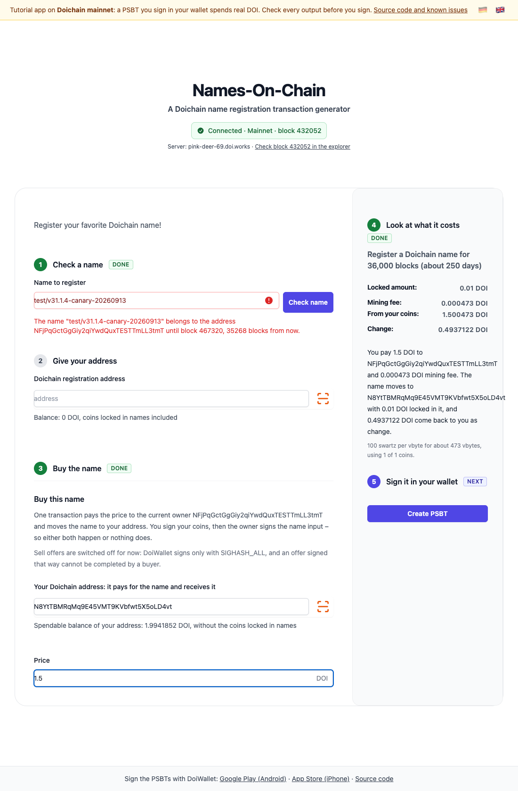

# Lesson 5: Atomic name trading

[Deutsch](05-atomic-name-trading.de.md) · App [`apps/lesson05`](../../apps/lesson05) · [Live demo](https://doichain.github.io/names-on-chain/lesson05/) · Previous: [Lesson 4](04-psbt-over-qr-and-signing.md)

A name can change hands between people who do not trust each other. One transaction pays the holder and moves the name to the buyer, so either both happen or nothing does. Namecoin calls this [atomic name trading](https://www.namecoin.org/docs/name-owners/atomic-name-trading/). The app builds such a purchase as a PSBT.



## What you learn

- How one transaction can hold both halves of a trade.
- Who signs what, and in which order.
- What a seller has to check before signing the last input.

## What you bring along

From the lessons before:

- `@names-on-chain/lesson04/components/PsbtQr.svelte` and
  `@names-on-chain/lesson04/doichain/describePsbt.js` — the QR code of lesson 4.
- `@names-on-chain/lesson03/doichain/fees.js` and
  `@names-on-chain/lesson02/doichain/addressValidation.js`.

New in `apps/lesson05`: `buildNameTradePsbt.js`, `doiAmount.js` and the purchase
components. And this lesson has its own `getNameOpUTXOsOfTxHash.js`, which returns
the value of an output in swartz — a trade computes with it, so everything that
reads outputs comes along: `nameShow.js`, `nameDoi.js`, `utxoHelpers.js`,
`transactionChecks.js` and the registration.

## Start

```bash
pnpm --filter @names-on-chain/lesson05 dev
```

### Write it yourself

```bash
pnpm start-state lesson05
```

That empties the part of `buildNameTradePsbt.js` this lesson is about — assembling the trade — and leaves a
TODO in its place. The app still builds and still starts; it stops exactly there. When
you want the answer back:

```bash
git checkout apps/lesson05
```

## Checkpoint

- Type a name that is taken. Further down, **Buy this name** opens.
- Enter your address in the purchase form and a price in DOI, such as `1.5` or `1,5`. This address pays, and it receives the name and your change.
- The box on the right and a sentence below it say what goes where: the price to the holder, the name with 0.01 DOI to you, your change.
- Create the PSBT as in lesson 4. Before signing, find each of these outputs in DoiWallet.

## How a purchase works

1. The app looks up the output that holds the name today, and the address of its holder.
2. It builds one transaction:
   - **Inputs:** your coins, and the output that holds the name.
   - **Outputs:** the price to the holder, plus whatever the name output held beyond the locked 0.01 DOI; the name with its current value and 0.01 DOI to you; your change.
3. You sign your inputs in DoiWallet and hand the PSBT to the holder.
4. The holder checks the outputs, signs the name input and sends the transaction.

Nothing that decides where money goes comes from the ElectrumX server: your address is the one you typed, the holder's address is read from the name script, and every amount is read from raw transactions whose hashes match their txids. The builder is `buildNameTradePsbt` in `apps/lesson05/src/lib/doichain/buildNameTradePsbt.js`; `parseDoiAmount` in `doiAmount.js` reads the price.

Lesson 5 needs an address field twice, for the name and for the coins that pay
for it, so that field became `AddressField.svelte`: label, input, scan button and
message region in one component, with the messages filled in per place.

## Names at SegWit addresses

On regtest, DoiWallet 7.0.4 signs a name input at a P2WPKH address (`dc1q…`) like a legacy input, and Doichain Core refuses the transaction. Names at P2PKH addresses can be bought as described. For a name at a SegWit address the app warns, because its holder could not complete the purchase with DoiWallet yet.

## Sell offers are switched off

A seller could sign first with `SIGHASH_SINGLE|ANYONECANPAY` and pass the half-signed transaction around as an offer. DoiWallet signs only with `SIGHASH_ALL`, and an offer signed that way cannot be completed by a buyer. So the app builds purchases only.

## Exercise

- Pick a taken name and build a purchase PSBT for it. Decode it (lesson 4) and match each output to the sentence in the app.
- Write down the checklist a holder should go through before signing the name input: which outputs must exist, to which addresses, with which amounts?

<details>
<summary><strong>Under the hood</strong></summary>

- **Why the order is safe.** With `SIGHASH_ALL` each signature commits to all inputs and outputs. Your signatures are useless without the holder's, and the holder's signature only works for exactly the outputs you already signed. Neither side can take one half and leave the other.
- **The value stays.** The name moves with the bytes it holds today, even if they are not valid UTF-8. The buyer can change the value with the next update.
- **The surplus goes back.** If the old name output held more than 0.01 DOI, the rest is the holder's money and is added to the price.
- **Ownership rule.** Since block 431,017 only a transaction that spends the name's previous output can change the name. Before the split a purchase gave no such guarantee: anybody could overwrite a name.
- **What you still trust.** A server can hide a newer operation on the name. The holder signs last and can see whether the name input is really the name's current output; the transaction fails if it is not.

</details>

## Common problems

- **"The name is not in a block yet"** A name can be bought once its last transaction is confirmed.
- **"This name already belongs to …"** You typed a name your own address holds.
- **"This name was last written with another operation than name_doi."** Lesson 5 only trades names written with `name_doi`.
